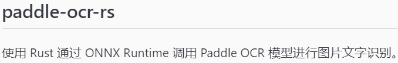
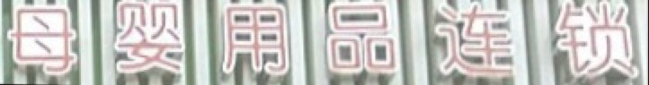

# PP-OCR-RS

<div align="center">


[](LICENSE)
[](https://crates.io/crates/pp-ocr-rs)

**High Performance · Rust-based OCR Engine**

Image text recognition service based on Paddle OCR onnx models, compatible with OpenAI's chat/completions API.

[Features](#features) • [Quick Start](#quick-start) • [CLI Tool](#cli-tool) • [API Service](#api-service) • [Performance](#performance)

**Languages:** [English](README_EN.md) | [简体中文](README.md)

</div>

---

## ✨ Features

- 🚀 **Extreme Performance** - Native Rust implementation with memory safety and zero-copy optimization
- 🎯 **High Accuracy Recognition** - Supports the latest Paddle OCR v5 models
- 🔧 **Flexible Configuration** - Rich parameter configuration to adapt to different scenarios
- 📦 **Ready to Use** - Simple CLI tool, no programming required
- 🌐 **API Service** - Built-in HTTP API server compatible with OpenAI interface format
- 🔄 **Concurrent Processing** - Multi-threading support for efficient batch request handling
- 📊 **Detailed Output** - Support for JSON/text formats with confidence information

---

## 🚀 Quick Start

### Installation

```bash
# Clone the project
git clone https://github.com/go-restream/pp-ocr-rs.git
cd pp-ocr-rs

# Build CLI tool
cargo build --release

# Build API service (with server feature)
cargo build --release --features server
```

### Basic Usage

```bash
# Recognize a single image
./target/release/ocr image.png

# Batch recognize images in directory
./target/release/ocr /path/to/images/

# Start API service
./target/release/ocr serve -c config.yaml
```

---

## 🛠️ CLI Tool

### Command Line Arguments

```bash
OCR Engine - Image text recognition using Paddle OCR

Usage: ocr [OPTIONS] <INPUT>

Arguments:
  <INPUT>    Image file or directory containing images

Options:
  -c, --config <FILE>             YAML configuration file path
  -f, --format <FORMAT>           Output format [text|json] [default: text]
  -o, --output <FILE>             Output file path
      --append                    Append mode (when outputting to file)
  -r, --recursive                 Process subdirectories recursively
  -q, --quiet                     Quiet mode
  -v, --verbose                   Verbose mode
      --pretty-json               Pretty JSON output
      --include-confidence        Include confidence information
      --include-processing-time   Include processing time information
  -h, --help                      Print help information
```

### Configuration File Example

Create `config.yaml`:

```yaml
# Model paths
det_model_path: "./models/ch_PP-OCRv5_mobile_det.onnx"
cls_model_path: "./models/ch_ppocr_mobile_v2.0_cls_infer.onnx"
rec_model_path: "./models/ch_PP-OCRv5_rec_mobile_infer.onnx"

# Feature switches
use_angle_cls: false
use_direction_cls: false

# Detection parameters
detection:
  box_limit: 50
  box_thresh: 0.5
  min_box_size: 0.3
  unclip_ratio: 1.6

# Output settings
output:
  include_confidence: true
  pretty_json: true
  include_processing_time: true
```

---

## 🌐 API Service

### Start Service

```bash
# Use default configuration (listen on 0.0.0.0:8080)
./target/release/ocr serve

# Use configuration file
./target/release/ocr serve --config config.yaml

# Custom bind address and thread count
./target/release/ocr serve --bind 127.0.0.1:9000 --threads 8
```

### API Endpoints

#### Health Check

```bash
curl http://localhost:8080/v1/health
```

#### Get Model List

```bash
curl http://localhost:8080/v1/models
```

#### OCR Recognition (OpenAI Compatible Format)

```bash
curl -X POST http://localhost:8080/v1/chat/completions \
  -H "Content-Type: application/json" \
  -d '{
    "model": "ch_pp_ocr_v5_mobile",
    "messages": [{
      "role": "user",
      "content": [{
        "type": "image_url",
        "image_url": {
          "url": "data:image/png;base64,iVBORw0KGgoAAAANSUhEUgAAAAEAAAAB..."
        }
      }]
    }]
  }'
```

### Python Client Example

```python
import base64
import requests

# Read image
with open('image.png', 'rb') as f:
    image_data = base64.b64encode(f.read()).decode('utf-8')

# Send OCR request
response = requests.post(
    'http://localhost:8080/v1/chat/completions',
    json={
        'model': 'ch_pp_ocr_v5_mobile',
        'messages': [{
            'role': 'user',
            'content': [{
                'type': 'image_url',
                'image_url': {
                    'url': f'data:image/png;base64,{image_data}'
                }
            }]
        }]
    }
)

# Parse result
result = response.json()
text = result['choices'][0]['message']['content'][0]['text']
print(f"Recognition result: {text}")
```

---

## 📊 Performance

### Recognition Results

| Test Image | Recognition Result | Confidence |
|------------|-------------------|------------|
|  | Use Rust to call Paddle OCR models through ONNX Runtime for image text recognition. | 95.27% |
|  | 母婴用品连锁 | 99.71% |

### Performance Metrics

- **Processing Speed**: Mobile model < 100ms/image (CPU)
- **Memory Usage**: < 200MB (single instance)
- **Concurrent Capacity**: Support multi-threaded concurrent processing
- **Accuracy**: > 95% in Chinese scenarios

---

## 🎯 Model Support

| Model Name | Type | Features | Use Cases |
|------------|------|----------|-----------|
| ch_pp_ocr_v5_mobile | Mobile | Fast speed, small size | Real-time processing, mobile devices |
| ch_pp_ocr_v5_server | Server | High accuracy, better results | Batch processing, high-precision requirements |

---

## 📝 Development Guide

### Requirements

- Rust 1.84+
- ONNX Runtime 2.0+

### Local Development

```bash
# Install dependencies
cargo build

# Run tests
cargo test

# Run examples
cargo run --example ocr_demo
```

### API Usage Example

```rust
use pp_ocr_rs::{OcrLite, OcrError};

fn main() -> Result<(), OcrError> {
    let mut ocr = OcrLite::new();

    // Initialize models
    ocr.init_models(
        "./models/det.onnx",
        "./models/cls.onnx",
        "./models/rec.onnx",
        2, // thread count
    )?;

    // Recognize image
    let result = ocr.detect_from_path(
        "test.png",
        50,    // box_limit
        1024,  // max_box_size
        0.5,   // box_thresh
        0.3,   // min_box_size
        1.6,   // unclip_ratio
        false, // use_angle_cls
        false, // use_direction_cls
    )?;

    // Output result
    for block in result.text_blocks {
        println!("Text: {} (Confidence: {:.2}%)",
                block.text,
                block.text_score * 100.0);
    }

    Ok(())
}
```

---

## 🤝 Contributing

Issues and Pull Requests are welcome!

1. Fork this project
2. Create feature branch (`git checkout -b feature/AmazingFeature`)
3. Commit your changes (`git commit -m 'Add some AmazingFeature'`)
4. Push to the branch (`git push origin feature/AmazingFeature`)
5. Open a Pull Request

---

## 📄 License

This project is licensed under the [Apache License 2.0](LICENSE).

---

## 🙏 Acknowledgments

- [Rapid OCR](https://github.com/RapidAI/RapidOCR) - Excellent OCR model framework
- [Paddle-ocr-rs](https://github.com/mg-chao/paddle-ocr-rs) - Paddle OCR Rust model library

---

<div align="center">

**If this project helps you, please give it a ⭐️!**

[GitHub](https://github.com/go-restream/pp-ocr-rs) • [Documentation](docs/) • [Examples](examples/)

<br>

**Languages:** [English](README.md) | [简体中文](README_ZH.md)

</div>